# 🎯 Vietnam Weapon Detection System - Complete System Architecture v7.0

## System Overview

This document provides the **complete, production-ready architecture** for the Vietnam Drone Weapon Detection System with all hardware components including the **Gimbal Hub**.

---

## 1. Complete Hardware Architecture

```mermaid
graph TB
    subgraph "Drone Platform"
        DRONE["🚁 DJI Mavic Mini 2<br/>or equivalent"]
    end

    subgraph "Sensor Suite"
        RGB["📷 RGB Camera<br/>1920×1080 @ 30fps"]
        THM["🌡️ Gremsy Thermal Camera<br/>640×512 @ 30fps"]
        LASER["📏 Gremsy Laser<br/>Distance Meter"]
        IMU["⚖️ IMU/GPS<br/>Position + Attitude"]
    end

    subgraph "Gimbal System"
        GIMBAL["🎯 Gremsy VIO F1<br/>3-Axis Gimbal"]
        HUB["🔌 Gimbal Hub<br/>Power + Data Multiplexer"]
        CTRL["🎮 Gimbal Controller<br/>MAVLink Protocol"]
    end

    subgraph "Processing Unit"
        JETSON["💻 Jetson Orin NX<br/>100 TOPS | 8GB RAM | 25W"]
    end

    subgraph "Communication"
        LTE["📡 LTE Modem<br/>Cloud Upload"]
        RC["📻 RC Link<br/>Operator Control"]
    end

    subgraph "Storage"
        SD["💾 SD Card<br/>Local Evidence"]
    end

    DRONE --> GIMBAL
    RGB --> HUB
    THM --> HUB
    LASER --> HUB
    HUB --> GIMBAL
    GIMBAL --> CTRL
    CTRL <--> JETSON
    IMU --> JETSON
    JETSON --> LTE
    JETSON --> SD
    RC --> JETSON

    style HUB fill:#ff9800,color:#000
    style GIMBAL fill:#4caf50,color:#fff
    style JETSON fill:#2196f3,color:#fff
```



---

## 2. Gimbal Hub Architecture (NEW)

The **Gimbal Hub** is the central data multiplexer connecting all sensors to the gimbal controller.

```mermaid
flowchart TB
    subgraph Sensors["Sensor Inputs"]
        RGB["📷 RGB Camera<br/>HDMI/USB3"]
        THM["🌡️ Thermal Camera<br/>USB/Serial"]
        LASER["📏 Laser Rangefinder<br/>Serial"]
    end

    subgraph Hub["Gimbal Hub (Gremsy Hub)"]
        PWR["⚡ Power Distribution<br/>12V/5V Rails"]
        MUX["🔀 Signal Multiplexer<br/>Data Routing"]
        SYNC["🔄 Frame Synchronizer<br/>Timestamp Alignment"]
        UART["📡 UART Bridge<br/>RS-232/TTL"]
    end

    subgraph Outputs["Hub Outputs"]
        GMBL["🎯 To Gimbal<br/>PWM Control"]
        JTSN["💻 To Jetson<br/>USB3 + Serial"]
        TELEM["📊 Telemetry<br/>MAVLink Stream"]
    end

    RGB --> MUX
    THM --> MUX
    LASER --> UART
    
    MUX --> SYNC
    UART --> SYNC
    PWR --> RGB & THM & LASER
    
    SYNC --> GMBL
    SYNC --> JTSN
    SYNC --> TELEM

    style Hub fill:#ff9800,color:#000
    style SYNC fill:#4caf50,color:#fff
```



### Gimbal Hub Functions

| Function | Description | Specification |
| -------- | ----------- | ------------- |
| **Power Distribution** | Provides regulated power to all sensors | 12V @ 3A, 5V @ 2A |
| **Signal Multiplexing** | Routes video/data streams | RGB HDMI, Thermal USB |
| **Frame Synchronization** | Aligns RGB + Thermal timestamps | ±1ms accuracy |
| **UART Bridge** | Connects laser rangefinder | 115200 baud |
| **Telemetry Output** | MAVLink stream to Jetson | 50 Hz update rate |

---

## 3. Complete Software Pipeline Architecture


---

## 4. Complete Data Flow Diagram

```mermaid
sequenceDiagram
    box Hardware Layer
        participant CAM as RGB Camera
        participant THM as Thermal Camera
        participant HUB as Gimbal Hub
        participant GMB as Gimbal
        participant GPS as Drone GPS/IMU
    end
    
    box Processing Layer
        participant JET as Jetson Orin NX
        participant DET as YOLOv12n
        participant TRK as ByteTrack
        participant VER as Thermal LSTM
    end
    
    box Output Layer
        participant ALT as Alert System
        participant OPR as Operator
    end

    Note over CAM,OPR: Frame Processing Loop (30 FPS = 33ms/frame)

    CAM->>HUB: RGB Frame (HDMI)
    THM->>HUB: Thermal Frame (USB)
    HUB->>HUB: Synchronize timestamps
    HUB->>JET: Synced frames + metadata
    GPS->>JET: Position + Attitude
    GMB->>JET: Gimbal angles (MAVLink)

    JET->>DET: Preprocess 640×640
    DET->>DET: RGB backbone + Thermal backbone
    DET->>DET: CBAM fusion
    DET->>TRK: Final Detections (NMS-free)


    TRK->>TRK: IoU matching (Stage 1 + 2)
    TRK->>VER: Tracked objects + IDs

    VER->>VER: Extract F1-F5 features
    VER->>VER: LSTM inference (30-frame buffer)
    VER->>ALT: Combined confidence

    alt High Confidence (≥0.65)
        ALT->>JET: Compute gimbal command
        JET->>GMB: Center + Zoom (MAVLink)
        JET->>JET: GPS transformation
        ALT->>OPR: Alert notification
        Note over ALT,OPR: Evidence package created
    end

    Note over CAM,OPR: Total: 18-25ms latency (YOLO26 optimized)
```

---

## 5. Gimbal Control with Hub Integration


---

## 6. Evidence Collection Pipeline


---

## 7. System Wiring Diagram


---

## 8. Module Dependency Graph


---

## 9. Performance Specifications

### Latency Breakdown

| Stage | Time | Cumulative |
| ----- | ---- | ---------- |
| Hub → Jetson transfer | 2ms | 2ms |
| Preprocessing | 3ms | 5ms |
| YOLOv12n backbone | 7ms | 12ms |
| Thermal branch | 2ms | 14ms |
| CBAM fusion | 1ms | 15ms |
| Detection head | 2ms | 17ms |
| NMS + filter | 1ms | 18ms |
| ByteTrack | 2ms | 20ms |
| Thermal LSTM | 2ms | 22ms |
| **Total inference** | **22ms** | - |
| Gimbal command | 3ms | 25ms |
| GPS transform | 2ms | 27ms |
| **Total pipeline** | **27ms** | ✅ |

### Hardware Resources

| Resource | Allocation | Headroom |
| -------- | ---------- | -------- |
| GPU Memory | 2.5GB | 5.5GB free |
| CPU | 60% | 40% free |
| Power | 18W | 7W under TDP |
| Temperature | 60°C | 25°C to throttle |

---

## 10. Deployment Topology


---

## Quick Reference Tables

### Class Detection Thresholds

| Class | Min Confidence | Alert Level |
| ----- | -------------- | ----------- |
| knife_machete | 0.68 | MEDIUM |
| knife_machete | 0.72 | HIGH |
| metal_rod | 0.65 | MEDIUM |
| metal_rod | 0.72 | HIGH |
| any + zoom confirm | 0.82 | VERY_HIGH |

### Module File Mapping

| Component | File | Key Class |
| --------- | ---- | --------- |
| Detection | `src/detection/detector.py` | `WeaponDetector` |
| CBAM | `src/detection/detector.py` | `CBAMFusion` |
| Tracking | `src/tracking/tracker.py` | `ByteTracker` |
| Thermal | `src/thermal/verifier.py` | `ThermalVerifier` |
| Gimbal Hub | `src/gimbal/hub.py` | `GimbalHub` |
| Gimbal Ctrl | `src/gimbal/controller.py` | `GimbalController` |
| GPS | `src/gps/transformer.py` | `GPSTransformer` |
| Evidence | `src/evidence/collector.py` | `EvidenceCollector` |
| Pipeline | `src/pipeline.py` | `WeaponDetectionPipeline` |

---

**Document Version**: v7.0  
**Last Updated**: January 9, 2026  
**Status**: ✅ Complete with Gimbal Hub
